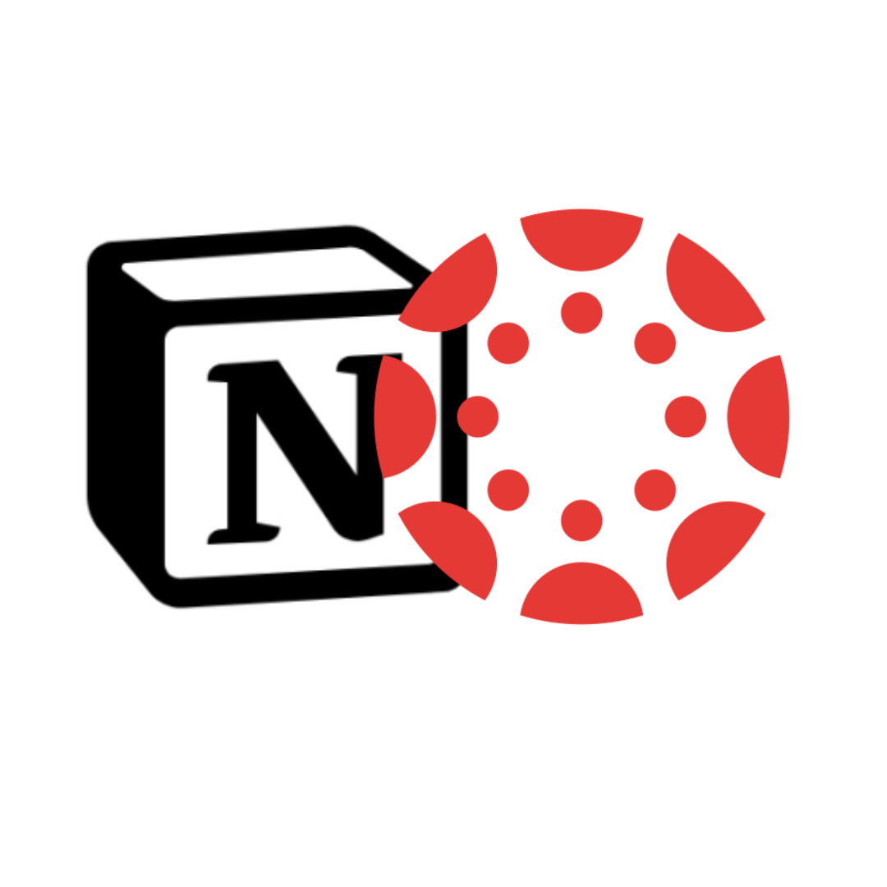

# Canvas to Notion Assignment Tracker

An automated system that seamlessly syncs Canvas LMS assignments to a Notion database, with intelligent prioritization and tracking features. This tool helps students manage their course workload by maintaining all assignment information in an organized Notion workspace.

 <!-- Replace with actual project banner -->

## 🌟 Features

- **Real-time Synchronization**: Automatically syncs Canvas assignments to Notion
- **Smart Prioritization**: Assigns priority levels based on assignment weights
- **Status Tracking**: Tracks submission status from Canvas
- **Grade Integration**: Displays grades when assignments are marked
- **Customizable**: Flexible database structure for your workflow
- **Automated**: Runs as a background service on macOS
- **Error Resilient**: Robust retry mechanisms for API failures

## 📋 What's Tracked

For each assignment, the system maintains:
- Due dates with timezone handling
- Course information with term filtering
- Full assignment descriptions
- Submission status (Not started, In progress, Submitted, Mark received)
- Priority levels based on assignment weight
- Direct links to Canvas assignments
- Grades when available

## 🖥️ System Requirements

- macOS (for launchctl automation, other platforms require different setup)
- Python 3.8 or higher
- Canvas API access (requires student account)
- Notion API access and integration

## 🛠️ Setup Instructions

### 1. Prepare Your Environment

Clone the repository and set up a virtual environment:

```bash
git clone https://github.com/yourusername/assignmentTracker.git
cd assignmentTracker
python -m venv venv
source venv/bin/activate  # On Windows: venv\Scripts\activate
```

Install the required dependencies:

```bash
pip install -r canvas-to-notion/requirements.txt
```

### 2. API Access Setup

#### Canvas API

1. Go to your Canvas account settings page
2. Scroll down to "Approved Integrations"
3. Click "New Access Token"
4. Give your token a name (e.g., "Assignment Tracker") and optionally set an expiration date
5. Copy the generated token for later use

#### Notion API

1. Go to [https://www.notion.so/my-integrations](https://www.notion.so/my-integrations)
2. Click "New integration"
3. Name your integration (e.g., "Canvas Assignment Sync")
4. Select the workspace where you want to create your assignment database
5. Set the capabilities (ensure "Read content", "Update content", and "Insert content" are selected)
6. Click "Submit" and copy your "Internal Integration Token"

### 3. Create Notion Databases

You have two options for creating the required Notion databases:

#### Automatic Setup (Recommended)

Run the setup script to automatically create the required databases:

```bash
cd canvas-to-notion/src
python setup.py
```

Follow the interactive prompts to:
- Enter your Canvas and Notion API credentials
- Select a parent page where the databases will be created
- Share the page with your integration

#### Manual Setup

If you prefer to set up manually:

1. Create an "Assignments" database in Notion with the following properties:
   - Assignment Title (title)
   - AssignmentID (number)
   - Description (text)
   - Due Date (date)
   - Status (status - with options: Not started, In progress, Submitted, Mark received, Dont show)
   - Priority (select - with options: Low, Medium, High)
   - Grade (%) (number)
   - Assignment Group (select)
   - Group Weight (number)

2. Create a "Courses" database with the following properties:
   - Course Name (title)
   - CourseID (multi-select)
   - Term (select)
   - Status (select - with options: Active, Archived)

3. Create a relation between the databases:
   - Add a "Course" relation property to the Assignments database, linked to the Courses database

4. Share both databases with your Notion integration

### 4. Configuration

Create a `.env` file in the `canvas-to-notion` directory with the following variables:

```env
CANVAS_TOKEN=your_canvas_token_here
CANVAS_URL=https://your-institution.instructure.com
NOTION_TOKEN=secret_your_notion_integration_token_here
NOTION_DATABASE_ID=your_assignments_database_id_here
COURSE_DATABASE_ID=your_courses_database_id_here
USER_ID=your_canvas_user_id
SYNC_INTERVAL=900 # 15 minutes in seconds
```

Tips for finding database IDs:
- Open your database in Notion
- The ID is in the URL: https://www.notion.so/workspace/[database-id]?v=...
- Copy the 32-character string that represents the database ID

## 🚀 Running the Application

### Test Your Configuration

Before starting the sync service, verify your API connections:

```bash
cd assignmentTracker
python test_connectivity.py
```

If both connections are successful, you'll see check marks for both Canvas and Notion APIs.

### Manual Sync

To perform a one-time sync of your assignments:

```bash
cd canvas-to-notion/src
python -m sync_service
```

This will fetch all your current assignments from Canvas and create or update them in your Notion database.

### Background Service (macOS)

For automatic syncing, set up a LaunchAgent:

1. Create a launch agent configuration file:

```bash
mkdir -p ~/Library/LaunchAgents
```

2. Create the plist file:

```bash
cat > ~/Library/LaunchAgents/com.user.canvas-notion-sync.plist << EOL
<?xml version="1.0" encoding="UTF-8"?>
<!DOCTYPE plist PUBLIC "-//Apple//DTD PLIST 1.0//EN" "http://www.apple.com/DTDs/PropertyList-1.0.dtd">
<plist version="1.0">
<dict>
    <key>Label</key>
    <string>com.user.canvas-notion-sync</string>
    <key>ProgramArguments</key>
    <array>
        <string>/usr/bin/python3</string>
        <string>$(pwd)/canvas-to-notion/src/sync_service.py</string>
    </array>
    <key>StartInterval</key>
    <integer>900</integer>
    <key>RunAtLoad</key>
    <true/>
    <key>StandardErrorPath</key>
    <string>$(pwd)/canvas-to-notion/logs/error.log</string>
    <key>StandardOutPath</key>
    <string>$(pwd)/canvas-to-notion/logs/output.log</string>
</dict>
</plist>
EOL
```

3. Create logs directory:

```bash
mkdir -p canvas-to-notion/logs
```

4. Load the service:

```bash
launchctl load ~/Library/LaunchAgents/com.user.canvas-notion-sync.plist
```

5. To unload (stop) the service:

```bash
launchctl unload ~/Library/LaunchAgents/com.user.canvas-notion-sync.plist
```

## 📝 Usage

### Working with Your Notion Database

After setup, your assignments will appear in your Notion database with the following workflow:

1. **View Assignments**: All current assignments appear in your database with status, due dates, and priorities
2. **Track Progress**: Change assignment status to "In progress" as you work on them
3. **Mark Complete**: The system will automatically update to "Submitted" when you submit in Canvas
4. **View Grades**: Grades appear automatically when marked in Canvas

### Filtering and Views

Create the following views in your Notion database for optimal workflow:

- **Current Assignments**: Filter for due dates in the next two weeks, sorted by due date
- **High Priority**: Filter for priority="High" to focus on important work
- **By Course**: Group by the Course relation to organize work by class
- **Completed**: Filter for status="Submitted" or status="Mark received" to see your accomplishments

## 🔧 Troubleshooting

### API Connectivity Issues

If you experience connection problems:

1. Check that your Canvas and Notion tokens are valid
2. Verify your Canvas URL is correct
3. Ensure your Notion integration has access to your databases
4. Run `test_connectivity.py` to diagnose issues

### Assignment Not Appearing

If assignments aren't showing up in Notion:

1. Check that the course is in the current term
2. Verify the assignment was created/updated after your last sync
3. Check logs for any error messages
4. Try running a manual sync

### Service Not Running

If the background service isn't working:

1. Check log files in `canvas-to-notion/logs/`
2. Verify that the service is loaded: `launchctl list | grep canvas-notion`
3. Try unloading and reloading the service

## 📄 License

This project is licensed under the MIT License - see the LICENSE file for details.

## 👤 Contributing

Contributions are welcome! Please feel free to submit a Pull Request.

